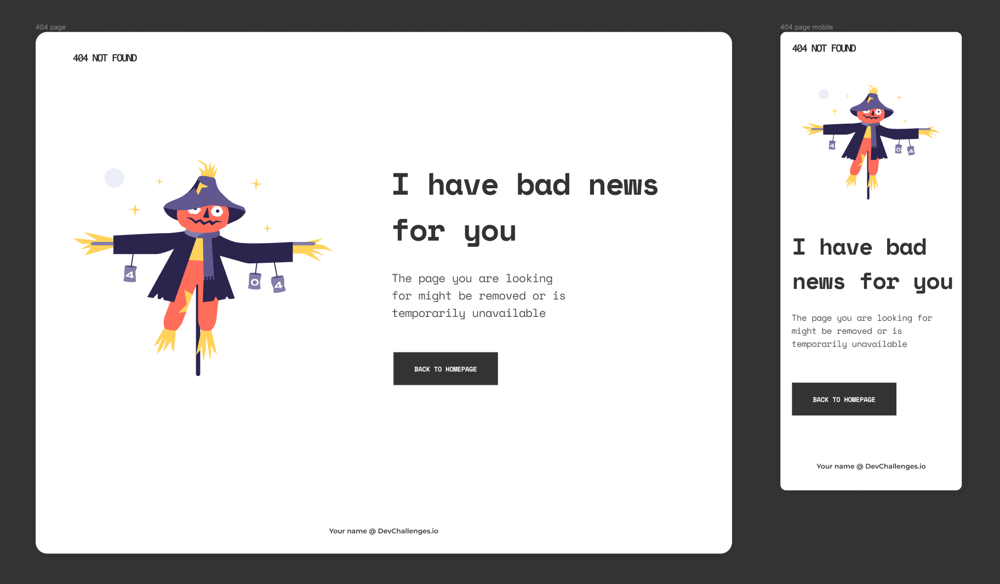

## 404 PAGE NOT FOUND | DEV CHALLENGES

## Le challenge

Voici ma solution au challenge sur Devchallenges.io.

## Démonstration

Lien vers le projet : https://aperbet56.github.io/404_page_not_found/

## Projet développé avec

- Utilisation des balises sémantiques HTML5
- CSS3
- Flexbox
- Animations CSS (transition)
- Page web responsive
- Desktop first
- Commentaires HTML
- Commentaires css
- Utilisation d'un normaliseur : le fichier normalize.css
- Importation des polices : "Montserrat", "Space Mono", "Inconsolata"
